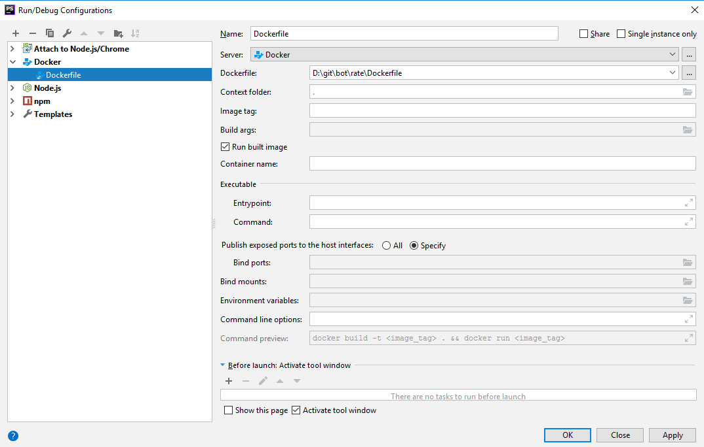

# Развёртывание рабочего окружения

Клонировать проект:

```bash
git clone git@gitlab.com:developmentKit/projects/bot/rate.git
```

Установить зависимости:

```bash
npm install
```

Установить windows-build-tools (для Osmosis):
```bash
npm install -g windows-build-tools
```

## Настройка WebStorm

Импортировать code style из файла `WebStormCodeStyle.xml`:


Включить поддержку ESLint:


Включить поддержку NodeJs библиотеки:


Настроить конфигурации запуска:





